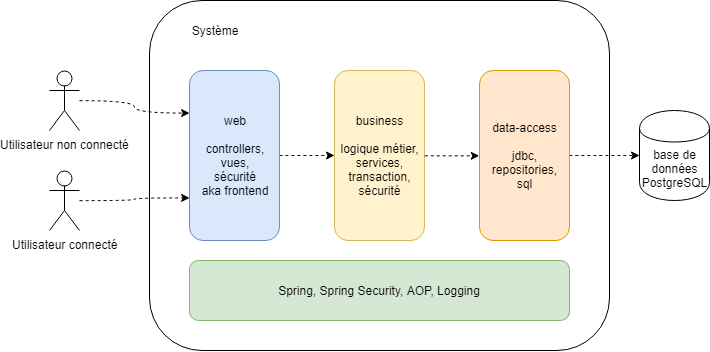
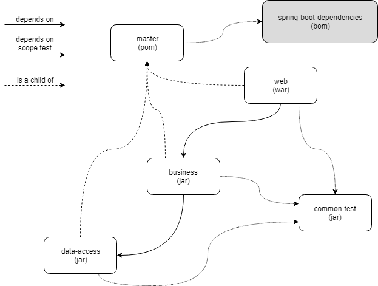
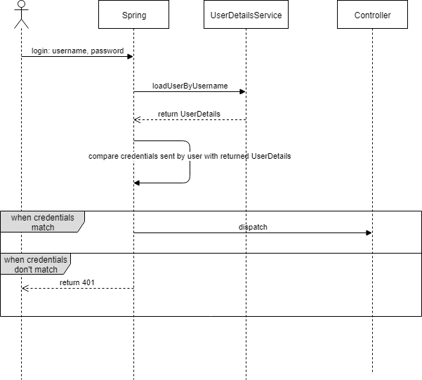

# Notre projet
Le contexte de notre projet est très simple: la gestion de Todos. Le contexte technique sera une application web, une base de données relationnelle PostgreSQL. 

Le projet va suivre une division technique, en trois couches: _web_ avec les vues, _business_ qui contient la logique métier, _data-access_ contenant la logique pour l'intéraction avec la base de données.

C'est très classique, le but ici n'est pas d'innover au niveau architectural ni de philosopher. Le projet a pour but de servir de support pour exposer et d'illustrer l'utilisation de certaines technologies et de pratiques. Sans toutefois faire n'importe quoi, bien entendu.
De manière transversale, la sécurité sera aussi de la partie, avec l'utilisation du modèle _RBAC_ (_Role-based Access Control_).

L'archive 'exécutable' de notre application web sera un _war_. Cette archive sera déployée sur un Tomcat 8. La version de Java utilisée est la 8. Nous utiliserons essentiellement Spring et Spring Boot comme framework principal. La sécurité sera mise en place avec Spring Security.

 


# Stories
* user story: _en tant qu'utilisateur, je veux avoir une liste de todos_
    * tâche: créer la db, la table, la séquence 
    * tâche: créer l'entity Todo (id, content, authorId) 
    * tâche: créer la configuration Spring data-access
    * tâche: créer le repository pour l'entité Todo
    * tâche: test _unitintegration_ du repository 
    * tâche: créer la configuration Spring business
    * tâche: créer le service pour le domaine Todo
    * tâche: tests unitaire et d'intégration pour le service
    * tâche: créer la configuration Spring web
    * tâche: créer le controller qui va servir la vue de la liste
    * tâche: service REST qui va servir la liste en JSON
    * tâche: tests unitaire et d'intégration pour le controller
    * tâche: créer la page de la vue pour la liste de todos 

* user story: _en tant qu'utilisateur, je dois accéder à une page d'accueil_ 
    * tâche: créer la page d'accueil
    
* user story: _en tant qu'utilisateur non connecté, je dois pouvoir me connecter_ 
    * tâche: ajouter le lien sur la homepage
    * tâche: créer la page
    * tâche: gérer la connexion qui se passe bien
    * tâche: gérer la connexion qui se passe mal
    
* user story: _en tant qu'utilisateur connecté, je dois pouvoir me déconnecter_ 
    * tâche: ajouter le lien sur la homepage   
    * tâche: gérer la déconnexion
    
* user story 2ème passe: _en tant qu'utilisateur connecté, je veux avoir une liste de MES todos_ 
    * tâche: utiliser le Authentication dans le controller
    
* user story: _en tant qu'utilisateur connecté, je veux ajouter un todo_
    * tâche: créer la page avec le formulaire
    * tâche: gérer la création qui se passe bien: utiliser le Principal dans le controller: redirection vers la même page
    
* user story: _en tant qu'utilisateur connecté, je veux changer le statut 'done' d'un todo_
    * tâche: en ajax
    
Pour vous entrainer:
* user story: _en tant qu'utilisateur connecté, je dois supprimer mes todos_    
    * tâche: ajouter le bouton et lui affecter l'action adéquate qui enverra une requête
    * tâche: ajouter une méthode pour gérer la requête de suppresion de todo dans un controller
    * tâche: ajouter une méthode pour gérer la requête de suppresion de todo dans un service
    * tâche: ajouter une méthode pour gérer la requête de suppresion de todo dans un repository
     
* user story: _en tant qu'utilisateur non connecté, je dois pouvoir m'enregistrer_ 
    * tâche: modifier la configuration spring security et la db   
    * tâche: créer la page   
    * tâche: gérer l'enregistrement qui se passe bien  
    * tâche: gérer l'enregistrement qui se passe mal
    
* user story: _en tant qu'utilisateur non connecté, je dois pouvoir me connecter sur une page propre au site_ 
    * tâche: modifier la configuration spring security  
    * tâche: créer la page   
    
* user story: _en tant qu'utilisateur non connecté, lorsque je me connecte, mes rôles doivent être chargés_ 
    * tâche: créer la table 
    * tâche: créer un repository/modifier un repository pour charger un author et ses rôles 
    * tâche: créer un service/modifier un service pour charger un author et ses rôles
    * tâche: modifier le CustomUserDetailsService 


# Spring
Spring est un framework libre et complet d'applications Java prenant en charge de nombreux aspects du développement et aidant à produire plus rapidement des applications de qualité et de performances élevées. Le framework se fonde sur de nombreux design patterns et conduit à employer les meilleures pratiques industrielles pour concevoir et implémenter les applications.

Spring est un conteneur dit « léger » à savoir que vous n'avez pas besoin d'utiliser un serveur d'applications souvent lourd et qui oblige à mettre en place toute une machinerie mais, et c'est là la force de Spring, vous pouvez bénéficier des mêmes avantages. 

Spring prend donc en charge la création d'objets (appelés bean) ainsi que leur cycle de vie, et surtout la mise en relation de ces objets (mécanisme appelé injection de dépendances) au moyen d'un fichier de configuration ou de code Java, tout ça de la manière la moins intrusive possible.

Cela est rendu possible car le coeur de Spring est constitué d'un conteneur IoC (Inversion of Control) qui prend en charge l'exécution principale du programme. 
Une application ne contrôle plus directement tout ce qui se passe, c'est Spring qui s'en charge.

 

C'est un concept très puissant qui permet de découpler complètement les dépendances entre objets. L'IoC est assuré par l'injection de dépendances, de plusieurs manières possibles Spring va construire votre objet (_bean_) et lui fournir ses dépendances et non pas le contraire, ainsi que la recherche de dépendances qui elle, permet à un objet d'interroger le conteneur afin de récupérer ses dépendances avec les autres objets.

De plus, Spring s'intègre avec de nombreuses technologies majeures afin de simplifier leur utilisation. Il est souvent décrit comme un couteau-suisse tellement les possibilités d'utilisation et d'intégration sont variées.

Spring utilise aussi abondamment la programmation par aspects afin d'automatiser et de rendre plus facile son utilisation, notamment avec l'utilisation de nombreuses annotations.


## Spring Boot
Spring Boot fournit principalement trois choses:
* un bom (_Bill Of Materials_): il s'agit d'une liste de composants utilisables, plus ou moins finis (à savoir utilisables en l'état). Le but principale est de faciliter la gestion des versions de tous les composants en jeu.
Lorsqu'il y a une nouvelle version, Spring assure que les versions de tous les composants inclus sont compatibles. Il s'agit aussi de faciliter la gestion des dépendances. Tout est au même endroit. Ce qui vient d'être dit est aussi valable pour les plugins Maven. 
* des starters: composants réutilisables et personnalisables
* des AutoConfiguration: l'**auto-magie**

La philosophie principale est, et a toujours été avec Spring, _convention over configuration_. Mais ça doit rester "personnalisable" (dans une certaine limite).


## Structure

* Spring Boot dependencies est ici utilisé comme _bom_ et non comme parent. En effet, l'utilisation comme parent nous empêche d'avoir notre propre parent.
Le choix est donc fait de ne pas se faire imposer certaines choses. On s'en sert vraiment comme répertoire contenant des déclarations de dépendances/plugins. 


# DB
Voici les quatre étapes pour la création de la base données _webappspringbasics_:
* ```create database webappspringbasics with ENCODING 'UTF8';```
* ```create user webappspringbasicsuser with password 'webappspringbasics';```  
* ```ALTER DEFAULT PRIVILEGES IN SCHEMA public GRANT ALL PRIVILEGES ON TABLES TO webappspringbasicsuser;```
* ```ALTER DEFAULT PRIVILEGES IN SCHEMA public GRANT ALL ON SEQUENCES TO webappspringbasicsuser;```

* ```GRANT ALL PRIVILEGES ON DATABASE webappspringbasics TO webappspringbasicsuser;```
* ```GRANT ALL PRIVILEGES ON ALL TABLES IN SCHEMA public TO webappspringbasicsuser;```

Le fichier contenant le ddl est dans common-test/src/main/resources (mauvais nom de projet...)


# Transaction
Une transaction permet d'assurer qu'un ensemble d'opérations vont être effectuées en respectant les propriétés **ACID**: _Atomic, Consistent, Isolated, Durable_. 
Je vous renvoie vers https://fr.wikipedia.org/wiki/Transaction_informatique qui explique cela tès rapidement et avec des mots simples.

Les transactions sont typiquement implémentées en mettant en place les design patterns _Command_ et _Memento_ principalement. Il y a bien entendu d'autres design patterns en jeu (_Composite, State, etc_).
Martin Fowler parle lui du pattern _Unit of Work_ (https://martinfowler.com/eaaCatalog/unitOfWork.html).

Notions importants:
* commit: quand une transaction s'est bien déroulée, les opérations sont donc appliquées. Quand les changements deviennent effectifs et que la transaction est terminée, elle est dite _committed_;

* rollback: pour assurer l'atomicité, lorsqu'il y a un problème, il faut que tout ce qui a été fait puisse être défait! C'est ce qu'on appelle le rollback;

* l'isolation: exprime jusqu'à quel niveau une transaction est isolée par rapport aux autres transactions. Exemple: il pourrait être opportun dans certains cas que deux transactions puissent voir les opérations intérmédiaires qui sont faites, même si celles-ci ne sont pas committed;

* propagation: va en quelque sorte permettre d'exprimer la durée de vie de votre transaction: quand créer une nouvelle transaction, que faire quand une transaction existe déjà, etc.
Voir org.springframework.transaction.annotation.Propagation de Spring.


# Test
Dans notre tutoriel, nous allons parler principalement de deux types de test:
* les tests unitaires : ils sont employés pour s'assurer du bon fonctionnement d'une portion d'un programme (appelée unité). 
Dans un langage orienté objet, une unité correspond généralement à une classe ou à une méthode. 
Plusieurs tests peuvent être crées pour la même unité afin de vérifier son comportement dans le meilleur ou le moins bon des cas par exemple.
Dans les tests unitaires, on ne teste pas l'unité dans le mondé réel, elle est testée indépendamment de tout le reste.
Mais une unité peut dépendre et utiliser d'autres unités, ce qui peut poser problème ici car les tests de notre unité seront alors dépendants du bon fonctionnement des autres unités. 
Pour résoudre ce problème, on va utiliser des objets simulacres (appelés mocks) dont on va prédéfinir le comportement et les résultats afin que ces objets soient totalement prévisibles et indépendants de leur implémentation.

* les tests d'intégration : ils sont utilisés pour tester plusieurs unités comme un tout. 
Ils vérifient si l'intégration des unités et leurs interactions sont correctes. 
Ils vont valider que toutes les parties développées indépendamment fonctionnent correctement ensemble.


## Tests unitaires
Le but est donc de tester une classe/méthode de manière isolée. Pour les tests unitaires, on utilisera principalement JUnit, Mockito et assertj.

* JUnit met à disposition des développeurs des annotations, des classes pour exécuter les tests (runners) ainsi que des moyens pour vérifier que les résultats obtenus sont bien ceux qu'on veut avoir;

* Mockito est donc une librairie permettant de créer dynamiquement des objets simulacres (mock) pour n'importe quelle interface ou classe. 
Une fois qu'un mock est crée, on va pouvoir lui dire comment il doit se comporter. Lorsqu'on exécutera effectivement le test, notre object se comportera exactement comme on l'a dicté. Une fois notre test terminé, on va pouvoir faire des vérifications afin de s'assurer que tout ce qu'on avait dicté a bien été exécuté.
Les objets mockés n'ont aucun intérêt dans les tests d'intégration car c'est en situation réelle: là tout est initialisé et les appels se font vraiment.
Dans les tests unitaires par contre, on veut pouvoir tester notre composant sans être dépendant du bon fonctionnement ou non d'un autre composant utilisé;

* assertj est une librairie permettant de faire des assertions dans nos tests de manière _fluent_, à savoir plus parlante, plus verbeuse. Cela permet d'avoir des tests qui ont du sens et qu'on peut lire.

Les tests unitaires, en plus de permettre de vérifier la logique implémentée, sont un excellent moyen de savoir si une classe/méthode est bien "faite".
En effet, au plus la cible est facile à tester, au plus vous pouvez avoir confiance dans son design. Si vous devez commencer à créer 10 mocks pour un simple test, il y un problème. 
De même, vous devez beaucoup configurer vos mocks pour un seul test, c'est que votre méthode a trop de préoccupations ou que la logique est bancale.

Dans certaines pratiques, on commence par écrire les tests avant d'écrire le code. Vous allez vite ressentir qu'en fait cela vient très naturellement.
Peut-être pas par commencer à écrire les tests, mais vous allez les écrire de plus en plus tôt. 
Les tests nous permettent de voir le code créé du point de vue de l'utilisation, plutôt que de l'implémentation.


## Tests d'intégration
Pour les tests d'intégration, l'approche est évidemment très différente. Il faut instancier la classe qu'on veut tester, mais aussi ses dépendances. Mais aussi les dépendances des dépendances, etc.

Dans le context de Spring, on n'instancie pas les classes directement: c'est Spring qui se charge de cela. Il faut donc créer un ApplicationContext pour les tests. Spring met à disposition beaucoup de choses pour faciliter cela.

Les tests d'intégration avec la base de données sont aussi importants. Il y a beaucoup de frameworks qui permettent de les faciliter, notamment en permettant de charger un nouveau schéma pour nos tests, de nettoyer les tables, de charger des données, de faire des vérifications, etc.

Même remarque que pour les tests unitaires: si la mise en place d'un test d'intégration est fastidieuse, c'est qu'il y a un problème de design.


# Spring Security
Tout est dans le nom. Spring Security s'occupe de la sécurité. Le framework peut le faire à plusieurs niveaux et de plusieurs manières. Il est extrêmement flexible et permet de mettre en place plusieurs modèles de sécurité.

Spring Security fait abondamment usage du **SpEL** (_Spring Expression Language_) qui est une sorte de DSL propre à Spring. Voir https://docs.spring.io/spring-security/site/docs/current/reference/html/el-access.html . 

 


# Ressources
* https://docs.spring.io/spring/docs/4.3.x/spring-framework-reference/htmlsingle/
* https://martinfowler.com/articles/injection.html
* https://getbootstrap.com/docs/4.0/getting-started/introduction/
* 